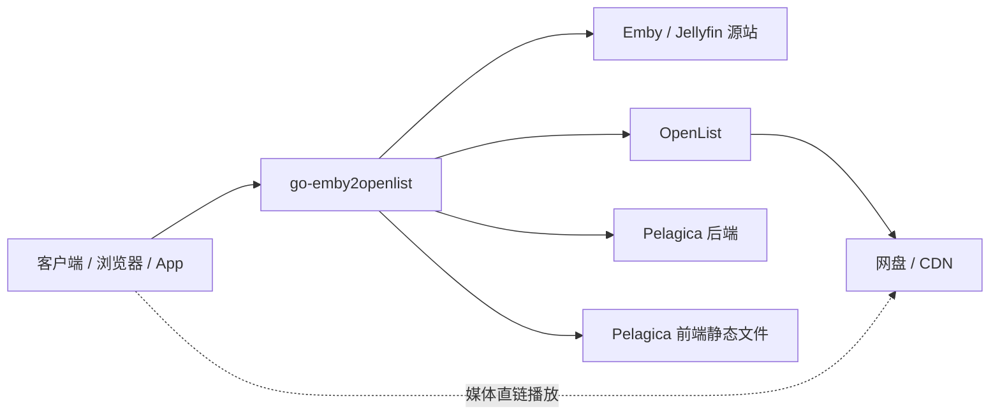

# go-emby2openlist

`go-emby2openlist` 是一个面向 Emby / Jellyfin + OpenList 的反向代理服务。它的核心目标是：让客户端在浏览媒体库时仍然像连接原始 Emby/Jellyfin 一样使用，但播放网盘媒体时尽量改走 OpenList 直链，从而减少服务器中转流量和转码压力。

本仓库当前还集成了 Pelagica 前端、Pelagica 后端、分享系统、本地目录树生成、外部播放器唤起等能力，适合想把“网盘媒体库 + 私有观影前端”整合成一套服务的用户。

> 项目仍然建议先在测试库验证路径映射和播放链路，再接入正式媒体库。

## 它解决什么问题

传统网盘挂载方案里，播放链路通常是：

```text
客户端 -> Emby/Jellyfin -> 挂载工具 -> OpenList -> 网盘
客户端 <- Emby/Jellyfin <- 挂载工具 <- OpenList <- 网盘
```

这意味着视频流量会经过媒体服务器。服务器上传带宽、CPU、磁盘缓存都可能成为瓶颈。

启用本项目后，普通 API 仍然由代理转发给 Emby/Jellyfin；遇到播放、下载、字幕、图片等关键资源请求时，代理会根据媒体路径映射到 OpenList，并尽量返回直链或代理后的资源：

```text
客户端 -> go-emby2openlist -> Emby/Jellyfin       获取媒体信息
客户端 -> go-emby2openlist -> OpenList -> 网盘    解析直链
客户端 -> 网盘 CDN                                播放真实媒体流
```

## 主要功能

- Emby/Jellyfin API 反向代理。
- OpenList 原画直链播放。
- `.strm` 媒体播放与路径映射。
- 阿里云盘等支持预览资源的网盘转码链接代理。
- 播放、下载、字幕、图片、WebSocket 等常用接口适配。
- 缓存中间件，降低源站和 OpenList 高频请求压力。
- OpenList 本地目录树生成，可生成 `.strm`、虚拟媒体文件、音乐文件占位和同名封面。
- Pelagica 一体化前端托管：访问根路径可进入现代化媒体前端，访问 `/web` 仍可回到原 Emby/Jellyfin Web。
- Pelagica 后端自动拉起和 `/api/*` 路由转发。
- 私有分享系统：用户可把媒体分享给其他用户，被分享者可在“共享库”查看和播放。
- 外部播放器唤起：支持在详情页调起 VLC、MX Player、PotPlayer、Infuse 等第三方播放器。
- 自定义 Web JS/CSS 注入。
- HTTP 与 HTTPS 双端口支持。

## 当前版本

当前代码版本：`v2.7.4`

默认端口：

| 服务 | 端口 | 说明 |
| --- | --- | --- |
| HTTP | `8095` | 默认访问入口 |
| HTTPS | `8094` | 启用 SSL 后使用 |
| 调试 | `60360` | Go pprof 调试端口 |
| Pelagica 后端 | `4321` | 默认由主程序在后台拉起 |

## 适合谁使用

适合：

- 已经有 Emby 或 Jellyfin 服务。
- 已经有 OpenList 服务。
- 媒体文件路径能在 Emby/Jellyfin 与 OpenList 之间建立映射。
- 希望减少媒体服务器转发流量。
- 希望使用 Pelagica 作为更现代的 Web 前端。

不适合：

- 没有 OpenList。
- 媒体库路径完全无法和网盘路径对应。
- 希望所有功能零配置自动识别。
- 对稳定性要求极高但不愿先建测试环境验证。

## 架构示意



## 快速部署：一体化 Docker Compose

推荐新用户优先使用一体化版本。它会把以下内容打包到同一个容器里：

- go-emby2openlist 代理后端
- Pelagica 后端
- Pelagica 前端静态页面

### 1. 准备配置目录

在项目根目录下准备配置：

```bash
mkdir -p config
cp config-example.yml config/config.yml
```

然后编辑：

```text
config/config.yml
```

至少需要改好：

- `emby.host`
- `emby.admin-api-key`
- `emby.mount-path`
- `openlist.host`
- `openlist.token`
- `path.emby2openlist`

### 2. 启动服务

```bash
docker compose up -d --build
```

启动后访问：

```text
http://服务器IP:8095
```

常用管理命令：

```bash
# 查看日志
docker logs -f go-emby2openlist-unified

# 修改配置后重启
docker compose restart

# 停止服务
docker compose down
```

## 纯代理模式

如果你只想使用原始 go-emby2openlist 反代能力，不想启用 Pelagica 一体化前端，可以使用 `docker-compose.yml` 里已经注释的 `Proxy Only` 服务。

纯代理模式适合：

- 继续使用官方 Emby/Jellyfin Web。
- 只想让官方客户端获得直链播放能力。
- 不需要共享库和 Pelagica 页面。

启用方式：

1. 注释掉 `go-emby2openlist-unified`。
2. 取消注释 `go-emby2openlist`。
3. 确认挂载 `config.yml`、`ssl`、`custom-js`、`custom-css`、`lib`、`openlist-local-tree`。
4. 重新执行 `docker compose up -d --build`。

## 配置说明

配置文件入口是：

```text
config.yml
```

一体化 Docker 模式下，容器内会读取：

```text
/config/config.yml
```

### emby

```yaml
emby:
  host: http://192.168.1.10:8096
  admin-api-key: your-admin-api-key
  mount-path: /openlist
  proxy-error-strategy: origin
  download-strategy: direct
  images-quality: 80
```

关键项：

| 配置 | 说明 |
| --- | --- |
| `host` | Emby/Jellyfin 源站地址 |
| `admin-api-key` | 管理员 API Key，分享系统和跨权限媒体查询需要 |
| `mount-path` | Emby/Jellyfin 看到的本地挂载根路径 |
| `proxy-error-strategy` | 代理异常策略：`origin` 回源，`reject` 拒绝 |
| `download-strategy` | 下载接口策略：`direct` 直链，`origin` 回源，`403` 禁止 |
| `images-quality` | 图片质量，建议 `70-90` |
| `local-media-roots` | 本地媒体根路径，命中后走源站逻辑 |

### openlist

```yaml
openlist:
  host: http://192.168.1.20:5244
  token: your-openlist-token
  365-enable: false
```

关键项：

| 配置 | 说明 |
| --- | --- |
| `host` | OpenList 访问地址 |
| `token` | OpenList API Token |
| `365-enable` | 是否启用 365 缩略图处理 |

### 路径映射

路径映射是最重要的配置。它告诉程序：Emby/Jellyfin 里的本地路径，对应 OpenList 里的哪个路径。

```yaml
path:
  emby2openlist:
    - /openlist/movie:/电影
    - /openlist/tv:/电视剧
```

例子：

```text
Emby 看到的路径：/openlist/movie/流浪地球.mkv
OpenList 真实路径：/电影/流浪地球.mkv
```

那么配置就是：

```yaml
- /openlist/movie:/电影
```

> 如果路径映射错了，最常见表现是：详情页正常，但播放无法解析直链。

### STRM 映射

如果媒体库里使用 `.strm` 文件，可以通过 `emby.strm.path-map` 替换 `.strm` 文件里的远程地址片段：

```yaml
emby:
  strm:
    path-map:
      - https://old.example.com => http://new.example.com
    internal-redirect-enable: false
```

### 缓存

```yaml
cache:
  enable: true
  expired: 1d
```

`expired` 支持：

- `s` 秒
- `m` 分钟
- `h` 小时
- `d` 天

部分特殊接口会使用内置固定缓存时间，例如直链、字幕、大接口缓存。

### SSL

```yaml
ssl:
  enable: false
  single-port: false
  key: example.key
  crt: example.crt
```

证书文件放在：

```text
ssl/
```

如果 `single-port: true`，程序只监听 HTTPS 端口 `8094`。

### Pelagica 一体化配置

```yaml
ge2o:
  api-secret: my-secret
  pelagica-backend-url: http://127.0.0.1:4321
  start-pelagica-backend: true
  pelagica-backend-path: ./pelagica-backend
  pelagica-frontend-dir: ""
```

说明：

| 配置 | 说明 |
| --- | --- |
| `api-secret` | 本地 API 密钥 |
| `pelagica-backend-url` | Pelagica 后端转发地址 |
| `start-pelagica-backend` | 是否由主程序自动拉起 Pelagica 后端 |
| `pelagica-backend-path` | Pelagica 后端可执行文件路径 |
| `pelagica-frontend-dir` | Pelagica 前端静态文件目录，留空时会自动探测 `dist` |

## OpenList 本地目录树生成

这个功能可以把 OpenList 的目录结构同步到本地目录，方便 Emby/Jellyfin 扫描媒体库。

常见用途：

- 为视频生成 `.strm` 文件。
- 为部分媒体生成空占位文件。
- 为音乐生成可扫描文件。
- 自动保存同名 `.jpg` 封面。
- 保留 `.nfo`、字幕、封面等辅助文件，避免误删。

示例配置：

```yaml
openlist:
  local-tree-gen:
    enable: true
    ffmpeg-enable: false
    strm-containers: mp4,mkv,ts
    music-containers: mp3,flac
    auto-remove-max-count: 6000
    refresh-interval: 10
    scan-prefixes:
      - /电影
      - /电视剧
    allow-containers: ass,srt,sub
    threads: 8
```

说明：

| 配置 | 说明 |
| --- | --- |
| `enable` | 是否启用目录树生成 |
| `ffmpeg-enable` | 是否启用 ffmpeg 辅助解析媒体信息 |
| `strm-containers` | 生成 `.strm` 的视频格式 |
| `virtual-containers` | 生成虚拟占位文件的格式 |
| `music-containers` | 音乐格式 |
| `auto-remove-max-count` | 自动删除保护阈值，避免异常时大量误删 |
| `refresh-interval` | 同步间隔，单位分钟 |
| `scan-prefixes` | 只扫描指定 OpenList 路径 |
| `allow-containers` | 允许处理的附属文件格式 |
| `threads` | 同步线程数 |

> `ffmpeg-enable` 会触发媒体信息解析，可能增加网络请求和风控风险。除非确实需要真实时长、音乐标签等信息，否则建议先保持关闭。

## 分享系统

分享系统依赖 `emby.admin-api-key`。它允许用户把媒体分享给其他用户，被分享者无需拥有原媒体库权限，也能在共享库中查看和播放。

核心接口：

| 接口 | 方法 | 说明 |
| --- | --- | --- |
| `/api/share/users` | GET | 获取可分享用户 |
| `/api/share/create` | POST | 创建分享 |
| `/api/share/mine` | GET | 我的分享 |
| `/api/share/shared-with-me` | GET | 分享给我的媒体 |
| `/api/share/{id}` | GET | 分享详情 |
| `/api/share/{id}` | DELETE | 取消分享 |

前端入口：

- 详情页：分享按钮。
- 侧边栏：共享库。
- 设置页：分享管理。

## 外部播放器

Pelagica 详情页集成了外部播放器按钮，可按设备环境生成不同协议链接。

支持方向：

- Android：VLC、MX Player 等。
- iOS：Infuse 等。
- Windows：PotPlayer、VLC 等。
- macOS：IINA、VLC 等。

能力：

- 复制播放直链。
- 传递续播位置。
- 尝试附带外置字幕。

## 自定义 JS / CSS

目录：

```text
custom-js/
custom-css/
```

用途：

- 给官方 Web 页面注入自定义脚本。
- 修改页面样式。
- 接入第三方播放器脚本。

调试模式：

```yaml
emby:
  custom-css-js:
    debug-mode: true
```

开启后，每次访问页面都会重新加载本地脚本，适合开发调试。

## 本地开发

### 后端

```bash
go run . -dr .
```

常用参数：

| 参数 | 默认值 | 说明 |
| --- | --- | --- |
| `-p` | `8095` | HTTP 端口 |
| `-ps` | `8094` | HTTPS 端口 |
| `-dr` | `.` | 数据根目录，程序会在这里读取 `config.yml` |
| `-version` | - | 输出版本号 |

### Pelagica 前端

```bash
cd pelagica/frontend
pnpm install
pnpm dev
```

### Pelagica 后端

```bash
cd pelagica/backend
go run .
```

## 构建

### 构建代理后端

```bash
go build -tags=goexperiment.jsonv2 -o ge2o .
```

### 构建一体化镜像

```bash
docker build -f Dockerfile.unified -t go-emby2openlist:unified .
```

## 排错清单

### 1. 页面能打开，但播放失败

优先检查：

- `path.emby2openlist` 是否能把 Emby/Jellyfin 的媒体路径映射到 OpenList 真实路径。
- OpenList Token 是否有效。
- OpenList 中对应文件是否能直接获取下载链接。
- 日志里是否出现路径映射命中信息。

### 2. 共享库里看不到内容

检查：

- `emby.admin-api-key` 是否配置。
- 当前登录用户是否能被 Emby/Jellyfin `/Users` 接口识别。
- 分享接口是否返回 401、403 或 404。

### 3. Pelagica 接口 404

检查：

- 是否使用一体化镜像。
- `ge2o.start-pelagica-backend` 是否为 `true`。
- Pelagica 后端是否监听在 `4321`。
- 前端填写的服务器地址是否指向 `go-emby2openlist`，而不是直接指向原始 Emby/Jellyfin。

### 4. 日志太多

可以关闭详细日志：

```yaml
log:
  verbose: false
  ignore-paths:
    - /web/modules
    - /favicon.ico
```

### 5. 控制台颜色乱码

```yaml
log:
  disable-color: true
```

## 重要提醒

- 配置前请备份 `config.yml`。
- 路径映射是本项目最核心、也最容易出错的地方。
- 不建议直接把 OpenList WebDAV 作为 Emby/Jellyfin 的唯一媒体挂载源，挂载波动可能导致媒体库误判文件被删除。
- 目录树生成涉及自动创建和清理文件，请先用小目录测试。
- 开启 ffmpeg 辅助解析前，请确认网盘风控风险可接受。
- 如果只追求成熟稳定的单纯直链反代，也可以评估 `embyExternalUrl` 等成熟方案。

## 仓库结构

```text
.
├── main.go                         # 主程序入口
├── internal/                       # go-emby2openlist 核心后端
│   ├── config/                     # 配置结构
│   ├── service/                    # Emby、OpenList、分享、m3u8 等服务
│   ├── util/                       # 通用工具
│   └── web/                        # 路由和代理处理
├── pelagica/                       # 集成的 Pelagica 前后端
│   ├── backend/
│   └── frontend/
├── custom-js/                      # 自定义脚本
├── custom-css/                     # 自定义样式
├── ssl/                            # HTTPS 证书目录
├── openlist-local-tree/            # 本地目录树输出目录
├── Dockerfile                      # 纯代理镜像
├── Dockerfile.unified              # 一体化镜像
├── docker-compose.yml              # Compose 示例
└── config-example.yml              # 配置示例
```

## 许可证

本项目遵循仓库内 `LICENSE` 文件声明的许可证。
