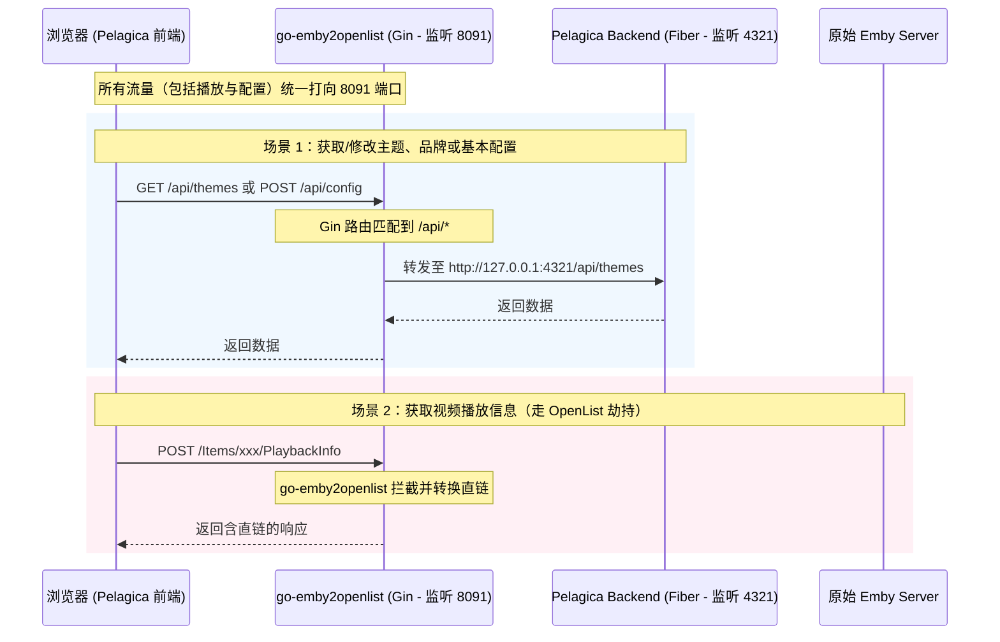

# Pelagica 后端与 go-emby2openlist 整合方案分析报告

作为项目的资深全栈架构师，针对您提出的“**是否将 Pelagica 后端与 go-emby2openlist 后端进行整合**”以及“**完全融合后难以同步原作者更新**”的顾虑，我进行了深度技术审查。

您的直觉非常敏锐且完全正确！如果进行**代码级的完全融合**，后续将彻底失去无缝同步原作者更新的能力。以下是详细的技术剖析及我为您设计的避坑与整合方案。

---

## 一、 Pelagica 后端定位与完全融合的隐患

### 1. Pelagica 后端的核心功能
Pelagica 官方的 `backend` 极其轻量，基于 `gofiber/fiber/v3` 开发，主要负责：
* **用户配置**：读写 `config.json`（保存界面偏好、Jellyfin 服务器地址缓存等）。
* **UI 主题**：读取和管理 `themes/` 下的主题 JSON 配置。
* **品牌定制**：上传/重置自定义的 Web Logo。
* **Studio 缓存**：代理获取制片厂（Studio）的缩略图并做本地缓存。

### 2. 深度合并（代码级硬翻译）的灾难
如果我们把 Pelagica 的 Go/Fiber 代码全部重写并塞进 `go-emby2openlist` 的 Go/Gin 路由中，会面临以下代价：
* **维护无底洞（API Drift）**：Pelagica 目前正处于活跃开发期。一旦原作者在后续版本中调整了主题的 JSON 结构、增加了数据库持久化、引入了用户播放同步（Sync Play）或开发了新版 API，我们每一次同步 Upstream 更新时，都必须手动将 Fiber 语法“人工翻译”为 Gin 语法，极易出错且极其耗时。
* **技术栈冲突**：Fiber 和 Gin 是两个完全不同的 Go Web 框架。将它们强行糅合在一个 Go Module 中，会导致依赖库版本冲突（例如 Ctx 传递、Body 绑定等中间件不兼容）。

---

## 二、 架构方案对比与选型

为了既能实现“部署时的单入口/单包简化”，又不破坏“与原作者代码的独立同步能力”，我们有以下三种设计方案：

| 维度 | 方案 A：完全独立双进程（容器编排） | 方案 B：go-emby2openlist 路由级反向代理（最推荐） | 方案 C：代码级硬合并（彻底融入） |
| :--- | :--- | :--- | :--- |
| **实现机制** | 前端 Nginx、Pelagica 后端、go-emby2openlist 作为三个容器独立运行，通过 Docker-compose 或 Nginx 路由分发。 | go-emby2openlist 作为主入口。如果是 `/api/config` 等 Pelagica 后端请求，通过 Go 内置的 `ReverseProxy` 转发给本地静默启动的 Pelagica backend 端口。 | 将 Fiber 代码手工翻译并重构成 Gin 路由，完全并入 `go-emby2openlist` 源码中。 |
| **部署难度** | 中等（用户需运行多容器，或配置 Nginx 反代规则） | **极低**（用户只感知到一个 go-emby2openlist 服务/容器） | **极低**（单个二进制文件） |
| **同步 Upstream 难度** | **零成本**（直接 pull 即可） | **极低**（Pelagica 前后端更新后，仅需重新编译 Pelagica backend 替换，无需修改一行代码） | 极高（每次更新都需人工翻译 Fiber->Gin，极易写出 Bug） |
| **侵入性** | 无侵入 | 无侵入 | 高侵入 |

---

## 三、 架构师推荐：方案 B（路由级反向代理 / 双进程桥接）

为了给用户提供最完美的“开箱即用”体验，同时保证我们开发时的“低耦合易同步”，**方案 B 是最佳选择**。

### 1. 运作原理拓扑图

### 2. 方案 B 的具体实现思路（原子化改造）

1. **go-emby2openlist 端新增转发路由**：
   在 `internal/web/route.go` 中，我们在匹配兜底的 `ProxyOrigin` 之前，加入一条匹配规则：
   如果请求的 Path 是 `/api/config`、`/api/themes`、`/api/branding` 等（或者直接正则匹配 `/api/` 且不包含 `emby2openlist` 自身的私有 API），则使用 Go 语言的 `httputil.NewSingleHostReverseProxy` 将请求透明转发至本地的 `127.0.0.1:4321`（Pelagica 后端的默认端口）。
   
2. **静默拉起子进程（可选）**：
   在 `go-emby2openlist` 的 `main.go` 启动时，如果检测到本地存在 `./pelagica-backend` 可执行文件，可以通过 `os/exec` 在后台静默启动它。这样用户双击运行 `ge2o` 时，会自动把 Pelagica 的后端也顺带运行起来，实现“单二进制”的运行体验。

3. **同步 Upstream 策略**：
   * **前端**：我们在 `pelagica/frontend` 中做出的二开修改（如中文翻译、分享按钮、OpenList 订阅面板）是与后端无关的，直接通过 git merge 同步官方更新。
   * **后端**：`pelagica/backend` 的源码保持 100% 官方原生，不作任何代码修改。官方更新了后端，我们直接 git pull 并重新编译即可，我们的反代层（`go-emby2openlist`）不需要做任何代码变动！

---

## 四、 结论与下一步行动

**请勿进行代码级完全融合。** 

如果您同意**方案 B（反向代理/低耦合桥接）**的路线：
1. 我们不需要动 Pelagica 后端的任何代码，这确保了它可以随时随地无缝同步原作者的更新。
2. 我们只需要在 `go-emby2openlist`（我们的 Go 代理项目）中增加一个针对 Pelagica API 的路由转发处理器，并配合打包脚本即可。

请确认是否采用**方案 B** 作为我们的整合设计？
