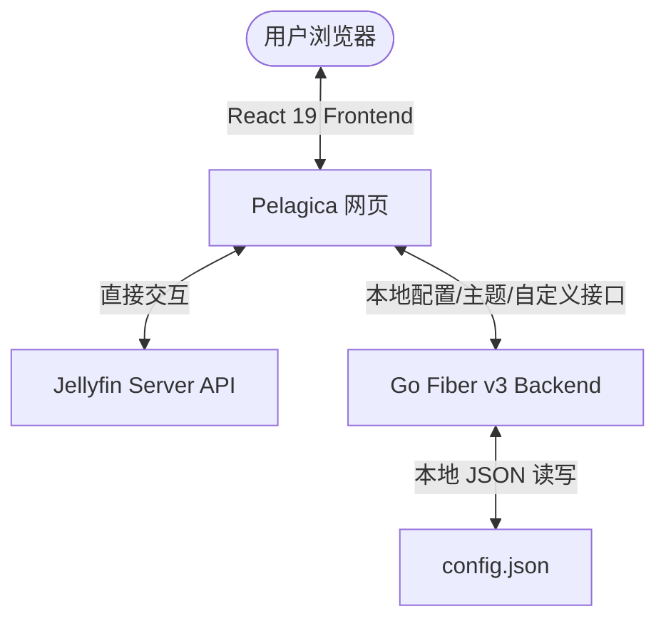
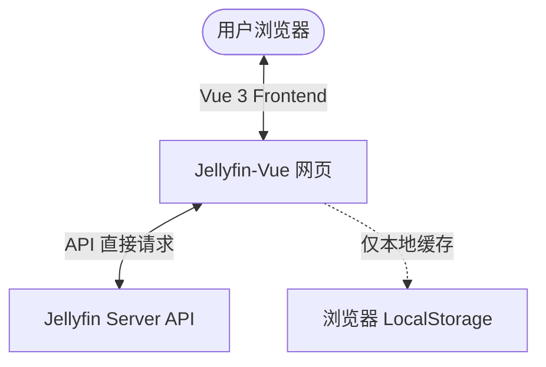

# Pelagica 与 Jellyfin-Vue 二次开发深度对比分析报告

针对您提出的将本地项目 **Pelagica** (`d:\Users\Documents\1\emby2openlist\pelagica`) 与官方的 **Jellyfin-Vue** 进行对比，评估哪一个更适合进行二次开发（二开），我们从技术栈、架构复杂度、历史债务、以及与您现有项目（`go-emby2openlist`）的协同契合度等多个维度进行了深入的架构级评估。

---

## 一、 核心结论：哪一个更容易二开？

### 🏆 强烈推荐：**Pelagica** 
对于您的开发背景和项目目标，**Pelagica 是二开难度更低、灵活性极高、且上限远超 Jellyfin-Vue 的绝佳选择**。

> [!IMPORTANT]
> **最核心的决策因素：**
> * **Pelagica 拥有自带的 Go 语言后端**，而您的主项目 `go-emby2openlist` 也是 Go 语言编写。这使得您可以极易将两者的后端代码融合，提供统一的本地配置管理、媒体列表同步和持久化缓存功能。
> * **Jellyfin-Vue 是一个纯前端 SPA 客户端**，受限于浏览器沙箱。如果二开涉及本地文件、自定义代理或跨服务器同步逻辑，Jellyfin-Vue 将无能为力，您必须另外再写一个后端。

---

## 二、 维度对比与深度分析

### 1. 技术栈与现代性对比

| 评估维度 | Pelagica | Jellyfin-Vue |
| :--- | :--- | :--- |
| **前端框架** | **React 19** (最新版) | **Vue 3** (主流版本) |
| **构建工具** | **Vite 7** + TypeScript | **Vite** + TypeScript |
| **样式方案** | **Tailwind CSS v4** + Radix UI (类似 shadcn) | 类似 Bulma 或自定义 CSS 框架 |
| **API 调用** | 官方 `@jellyfin/sdk` (强类型、标准维护) | 官方 `@jellyfin/sdk` 配合其封装层 |
| **状态/数据流** | **TanStack React Query v5** (极其优雅的异步缓存) | Vue 组合式 API + Pinia (传统状态流) |
| **后端支持** | **Go (Fiber v3)** - 超轻量、高性能、高度可控 | **无** (纯静态网页，依赖 Jellyfin API 运行) |

* **Pelagica 优势：** 使用了 React 19 和 Tailwind CSS v4。这在 UI 的定制上拥有顶级的自由度，借助于 Radix UI，可以极其快速地通过 Vibe Coding（意图驱动）拼装出美观、现代感爆棚的玻璃拟态或暗色系界面。同时，Vite 7 的极速热重载，让前端二开修改 UI 几乎是瞬时生效。
* **Jellyfin-Vue 状态：** 虽然也是 Vue 3 + Vite + TS 的现代化结构，但它经历了从早期 Vue 2 / Nuxt 框架迁移的历史背景，代码中存在一定数量的遗留兼容设计。

---

## 三、 架构设计与二开瓶颈分析

### 🔍 Pelagica 架构 (Go Backend + React Frontend)


* **高可扩展性的“混合”设计：** 
  Pelagica 的前端不仅直接与 Jellyfin Server 进行 API 交互（保证播放流畅、不增加服务器中转压力），还配备了一个小巧的 **Go (Fiber v3)** 后端。
  该后端当前仅负责管理：`/api/config`（配置修改）、`/api/themes`（自定义主题上传及管理）、`/api/studios`（工作室微缩图缓存）等。
* **二开切入点：** 
  因为拥有这个 Go 后端，如果您要加入“Emby 与 Jellyfin 联合订阅”、“自定义 OpenList 播放列表导出”、“本地规则网关”等功能，您可以**直接把 Go 逻辑写在这个后端中**，前端只需加一个 React Tab 标签，即可实现完美的软硬联动。

---

### 🔍 Jellyfin-Vue 架构 (纯前端 SPA)


* **沙箱化局限：** 
  Jellyfin-Vue 是官方为了做一个多端通用的轻量化客户端而建立的。它是**纯前端静态网页**。
  这意味着，您所有二开的功能都只能跑在用户的浏览器环境里。一旦用户清理浏览器缓存、或者更换设备，所有的自定义播放列表、二开同步状态、以及本地网关规则等配置全部都会**丢失**。
* **二开瓶颈：** 
  如果您想做需要后台静默运行的任务（例如：定时从 Emby 同步播放列表到 OpenList），纯前端 SPA 无法实现，您必须自己另外写一个常驻后台进程。这就人为地把二开割裂成了两个独立运行的项目，维护成本成倍增加。

---

## 四、 针对您的项目 (`emby2openlist`) 的定制建议

由于您的核心项目是 `emby2openlist`（旨在将 Emby 转换为开放列表/第三方播放列表），这意味着您需要处理以下逻辑：
1. **多媒体源鉴权与解析**（同时对接 Emby 和 Jellyfin）。
2. **列表转换逻辑**（定时/实时拉取媒体库，将其解析为 OpenList 格式，如 m3u 或其他自定义 API）。
3. **高频的数据读写与缓存**。

### 🚀 终极融合方案：`emby2openlist` + `Pelagica`
由于 Pelagica 本身就是用 Go + React 写的，您可以直接把 Pelagica **融合**进您的 `emby2openlist` 项目中：

1. **统一后端：**
   将 Pelagica 的 Go 后端（`backend` 文件夹）作为您 `emby2openlist` 的 WebUI 门户。您现有的 Go 数据处理逻辑可以直接 import 到这个后端中，或者直接在其 Fiber 框架中挂载新路由：
   ```go
   // 在 pelagica-backend 中直接挂载您的 emby2openlist 路由
   api.Get("/openlist/export", handlers.ExportOpenList) 
   api.Post("/openlist/sync", handlers.TriggerSync)
   ```
2. **统一前端：**
   在 Pelagica 极其现代的 React 前端中，在 `src/pages/Settings` 页面或者侧边栏加一个 "OpenList 同步" 面板。直接使用 `useQuery` 从您融合后的后端拉取同步状态。
3. **极其优雅的单容器部署：**
   最终通过 Docker 部署时，您的 OpenList 转换器、Pelagica 的 Go 后端、以及 React 静态前端，都可以打进同一个轻量级的 Docker 镜像中，做到“开箱即用”。

---

## 五、 总结与决策雷达

```
                    【二次开发难度雷达图】
                    
                      代码干净度 (现代性)
                            5 | Pelagica
                            / \
            UI 定制便利性   4---3  Jellyfin-Vue (开发慢)
                          /     \
    Go生态协同契合度(用户) 5       2  浏览器沙箱局限性 (Vue)
                          \     /
            后台任务执行能力  5---1  无后端 (仅静态)
                            \ /
                         部署便利度
```

* **选 Pelagica：** 适合希望快速做出高颜值界面，且需要处理**后台同步、跨平台配置、多媒体源聚合**等具有一定逻辑深度二开需求的开发者。由于您已经掌握 Go 语言，这一套能让您如虎添翼。
* **选 Jellyfin-Vue：** 仅当您是纯 Vue 3 开发者，且**完全不需要任何后端支撑**（所有数据只从官方 Jellyfin 读写），并准备将其封装为跨平台桌面端（例如 Electron / Tauri）时，才建议考虑。
