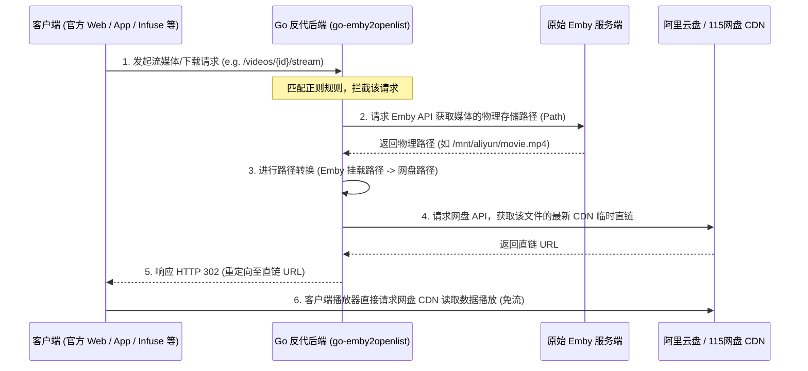

# go-emby2openlist 原项目纯后端反代与直链重定向机制

本文档详细拆解 `go-emby2openlist` 原项目（不考虑第三方前端 `Pelagica`）的反向代理与网盘直链播放的核心实现机制。

---

## 一、 核心架构：基于 HTTP 302 重定向的“免二开”劫持

原项目最精妙的设计在于：**利用标准的 HTTP 重定向协议（302 Redirect）实现对任意 Emby 客户端的透明拦截**。

### 0. 官方 App 与其他播放器如何连接到该反代？

> [!IMPORTANT]
> **官方 App、Infuse、Kodi 等客户端并没有任何专门用于连接该反代服务的“设置入口”。**
> 
> 连接的唯一方式是：在这些客户端中**添加 Emby/Jellyfin 服务器时，直接在“服务器地址 (Server URL)”输入框中填写 Go 反代服务器的监听地址（例如 `http://<Go-IP>:8095`）**，而不是填写真实的 Emby 服务地址（通常是 `8096` 端口）。

由于 Go 反代后端实现了绝大多数 Emby API 的透明透传（通过 `ProxyOrigin` 机制）：
1. 客户端在添加服务器并尝试登录时，请求会发送给 Go 反代。
2. Go 反代将登录握手、海报墙加载等非播放 API 默默转发给内网真实的 Emby 服务（如 `8096` 端口），并将结果返回给客户端。
3. 客户端（包括官方 App）在**完全不知情**的情况下，认为自己连接的就是一个标准的 Emby 服务器，因此能够正常登录和浏览。
4. 一旦用户点击播放，播放请求发往 Go 反代，反代后端立马实施拦截，计算出网盘直链并返回 `HTTP 302`，客户端播放器随即跳转到网盘 CDN 完成播放。

### 1. 直链重定向核心流程

当任何 Emby 客户端请求播放或下载媒体时，核心逻辑由 [redirect.go](file:///d:/Users/Documents/1/emby2openlist/internal/service/emby/redirect.go) 中的 `Redirect2OpenlistLink` 驱动：



### 2. 详细实现步骤

#### 步骤 A：请求拦截
在 [route.go](file:///d:/Users/Documents/1/emby2openlist/internal/web/route.go) 中，播放相关的 API 请求被正则路由拦截器分发：
```go
// 拦截普通视频流请求
{constant.Reg_ResourceStream, emby.Redirect2OpenlistLink},
// 拦截 master.m3u8 转码请求
{constant.Reg_ResourceMaster, emby.Redirect2Transcode},
// 拦截下载请求
{constant.Reg_ItemDownload, emby.Redirect2OpenlistLink},
```

#### 步骤 B：回源查询物理路径
当拦截到播放请求时，Go 后端并不知道该视频保存在网盘的哪个位置。它首先作为“客户端”去请求真实的 Emby 服务器，查询当前 `ItemId` 对应的媒体信息（[redirect.go:L89](file:///d:/Users/Documents/1/emby2openlist/internal/service/emby/redirect.go#L89)）：
* 调用 `getEmbyFileLocalPath` 拿到该视频在 Emby 服务端配置的物理路径（如 `/mnt/ali_share/Movies/Matrix.mp4`，或者是挂载的 `.strm` 文件链接）。

#### 步骤 C：网盘直链转换
* 如果物理路径是远程地址（strm），则直接通过 strm 路径映射获取直链，并响应 302。
* 如果是本地挂载的网盘路径，Go 后端调用 `path.Emby2Openlist(embyPath)` 将其转换为网盘服务的内部路径。
* 随后调用 `openlist.FetchResource` 接口，向底层的 OpenList 挂盘系统动态索取该文件当前可用的**高速临时下载直链**（阿里云盘/115网盘的直链通常有防盗链和有效期限制）。

#### 步骤 D：302 重定向
Go 后端拿到网盘直链后，在 Response Header 中填入 `Location` 头部，并向客户端返回 **`302 Temporary Redirect`**。客户端播放器接收到 302 状态码后，会自动跳转去拉取网盘 CDN 上的媒体数据。

---

## 二、 客户端增强：官方 Web 前端脚本注入

虽然 302 重定向能解决“视频流劫持”的问题，但官方 Emby 网页前端在浏览器中运行仍有两大痛点：
1. **浏览器解码局限**：浏览器内置播放器仅支持部分格式（如 mp4、h264，不支持 mkv、hevc、ass 特效字幕），会频繁触发 Emby 服务端强行转码，无法走直链。
2. **需要调用外部播放器**：为了流畅播放，用户通常需要在网页端点击按钮直接唤醒本地安装的 PotPlayer、IINA、VLC 等播放器。

为了解决这一问题，原项目设计了 **HTML 自动注入机制**：

### 1. index.html 拦截劫持
在 `route.go` 中，路由规则 `{constant.Reg_IndexHtml, emby.ProxyIndexHtml}` 拦截了对 Emby 官方首页 `index.html` 的请求。
在 [custom_cssjs.go](file:///d:/Users/Documents/1/emby2openlist/internal/service/emby/custom_cssjs.go#L174) 的 `ProxyIndexHtml` 函数中：
```go
// 1. 请求原 Emby 首页
resp, err := https.ProxyRequest(c.Request, config.C.Emby.Host)
// 2. 读取 HTML 内容，在 </body> 前注入自定义 JS 和 CSS 的路径
content := string(bodyBytes)
content = strings.ReplaceAll(content, "</body>", `<script src="/emby2openlist/custom.js"></script>` + "\n</body>")
content = strings.ReplaceAll(content, "</body>", `<link rel="stylesheet" type="text/css" href="/emby2openlist/custom.css">` + "\n</body>")
```

### 2. 动态加载自定义脚本
浏览器加载修改后的 `index.html`，就会主动向 Go 后端请求 `/emby2openlist/custom.js`。
* Go 后端中的 `ProxyCustomJs` 会读取本地 `custom-js/` 文件夹下的所有 `.js` 文件内容。
* 它为每一个脚本包装一个**自执行函数**，并通过 `setTimeout` 不断检测 `ApiClient`（Emby 前端 SDK 的全局对象）是否初始化完毕：
  ```javascript
  (function() {
    function waitForEmby() {
      if (typeof ApiClient !== 'undefined' && ApiClient !== null) {
        // 执行用户的劫持 JS 代码
      } else {
        setTimeout(waitForEmby, 100);
      }
    }
    waitForEmby();
  })();
  ```

### 3. 自定义 JS 在官方 Web 端的劫持工作
被注入的脚本通常通过重写 `ApiClient.getUrl` 或劫持官方播放器的播放事件：
1. 捕获用户的“点击播放”行为。
2. 阻止浏览器默认 the HTML5 播放行为。
3. 动态获取网盘直链，或调用本地特定的协议（如 `potplayer://...`）直接拉起本地的高性能播放器进行播放。

---

## 三、 部分媒体库反代方案评估

对于“只想部分媒体库走反代直链，其余媒体库由 Emby 原始播放”的需求，**完全不需要大规模改造**。目前项目架构已经可以低成本实现：

### 1. 方案 A：零代码修改，基于物理路径前缀进行过滤（已支持）
* **回源黑名单（`local-media-roots`）**：在 `config.yml` 的 `emby.local-media-roots` 列表中，添加那些只想本地播放的库所对应的物理挂载目录。反代服务检测到视频物理路径带有该前缀时，将自动绕过直链获取，降级回源由 Emby 原始处理。
* **直链白名单（`emby2openlist` 映射）**：只将网盘挂载库（如 `/mnt/aliyun`）配置在 `path.emby2openlist` 的路径转换映射中。对于那些不进行映射的本地库物理路径，转换直接报错失效，Go 后端会捕获异常并自动进行回源播放处理。

### 2. 方案 B：极轻量代码改造，基于 Emby 媒体库白名单过滤（仅需修改 ~10 行代码）
如果希望能直接根据 Emby 的媒体库名称（如“本地电影”、“云盘动漫”）进行逻辑分流，可在 [redirect.go](file:///d:/Users/Documents/1/emby2openlist/internal/service/emby/redirect.go#L67) 拦截入口处加几行判断：
1. **获取元数据**：利用 `itemInfo.Id` 在后台向 Emby 源服务器调一下 API 获取其所属的媒体库大类（`CollectionFolder`）。
2. **过滤分流**：
   ```go
   // 伪代码思路
   collectionName := getCollectionNameByItemId(itemInfo.Id)
   if !slices.Contains(config.C.Emby.ProxyCollections, collectionName) {
       // 不在允许反代的媒体库白名单里，直接走原片代理回源
       ProxyOrigin(c)
       return
   }
   ```
这个改动非常轻量，仅需在 `redirect.go` 引入一个简单的元数据查询并过滤即可。

---

## 四、 性能考量：避免本地视频流经过 Go 服务中转

在默认的回源降级机制下，Go 反代服务是通过 `ProxyOrigin` 内的 `io.CopyBuffer` 对视频流进行内存中转的。如果直接采用该方式，**确实会让本地视频流数据经过 Go 后端，产生大量的 CPU 拷贝开销和网络带宽占用**。

### 🚀 终极解决办法：重定向到原始 Emby 物理 Host（流量零中转）

为了彻底避免本地媒体（或不需要反代的媒体）流量流经 Go 服务，可以通过 **302 重定向到真实 Emby 物理服务** 来解决：

#### 1. 原理与自动判定逻辑

> [!TIP]
> **这完全是可以通过视频的“物理存储路径”进行 100% 自动判断的，不需要用户手动指定哪些库需要分流！**

当客户端向 Go 代理发起播放请求时，Go 反代的自动判断与分流机制如下：
1. **自动获取物理路径**：Go 反代利用 `itemId` 率先向原始 Emby 查询元数据，获取当前视频的物理存储路径（`Path`），例如：
   - 视频 A（存放在网盘）：物理路径为 `/mnt/aliyun/Movies/Matrix.mp4`
   - 视频 B（本地硬盘）：物理路径为 `/data/local/FamilyVideo.mp4`
2. **前缀自动匹配**：
   - Go 反代将获取到的物理路径与配置文件 `config.yml` 中定义的网盘映射前缀（`path.emby2openlist`）进行**前缀匹配**。
   - **如果匹配成功**（例如 `/mnt/aliyun` 在映射中）：Go 判定它是网盘视频，解析出网盘直链后，响应 **`302 重定向 ➡️ 网盘 CDN 直链`**。
   - **如果匹配失败**（不在映射中，或者在 `local-media-roots` 列表中）：Go 判定它是本地视频，直接响应 **`302 重定向 ➡️ 原始 Emby 物理端口（如 8096）绝对地址`**。

通过“物理路径前缀匹配”，Go 反代后端能在播放瞬间**自动、无感地对视频流进行完美分流**，网盘视频走直链，本地视频直通 Emby 端口，双方流量完全互不干扰，且不需要做任何媒体库的手工标注。

#### 2. 极简改动方案
只需在代码中实现一个直接重定向到源站的函数，替代原本的 `ProxyOrigin` 处理：
```go
// RedirectToRealEmby 针对不需要走直链的流媒体，直接重定向回原 Emby 服务器，实现流量绕过
func RedirectToRealEmby(c *gin.Context) {
    // 拼接真实 Emby Host 绝对路径，并携带全部 Query 参数
    realUrl := config.C.Emby.Host + c.Request.RequestURI
    logs.Info("本地/非代理库媒体播放，重定向至原 Emby 节点: %s", realUrl)
    c.Redirect(http.StatusTemporaryRedirect, realUrl)
}
```
在 `IsLocalMediaPath` 判定成功或非白名单媒体库判定成功时，调用该函数即可，从而保证 Go 后端完全不被流媒体流量拖垮。

