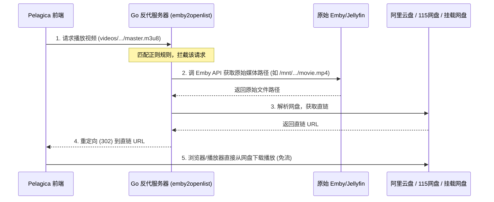
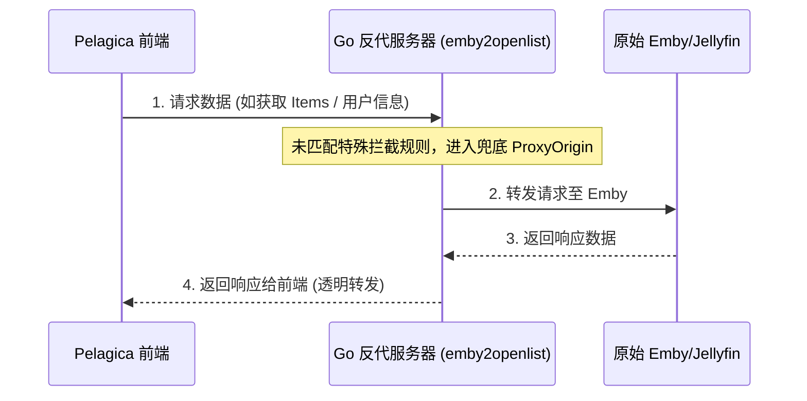

# go-emby2openlist 反向代理实现原理及新前端连接分析

本文档深入分析了 `go-emby2openlist` 的反向代理（反代）实现机制，以及新的第三方 React 前端 `Pelagica` 是如何与该反代服务器进行连接和协同工作的。

---

## 一、 反向代理（反代）是如何实现的？

`go-emby2openlist` 的反向代理采用 **Go + Gin 框架**，通过构建自定义的路由规则匹配器，实现了“精准拦截关键 API、透明透传其余流量”的功能。

### 1. 核心路由与全局分发
项目在 [route.go](file:///d:/Users/Documents/1/emby2openlist/internal/web/route.go) 中注册了一个全局通配符路由：
```go
func initRoutes(r *gin.Engine) {
    r.Any("/*vars", globalDftHandler)
}
```
所有请求都会进入 [handler.go](file:///d:/Users/Documents/1/emby2openlist/internal/web/handler.go) 中的 `globalDftHandler`，该处理器会依次使用正则表达式匹配请求的 `RequestURI`。

### 2. 匹配与拦截策略
在 `route.go` 中，定义了数十条路由拦截规则（按优先级顺序）：
* **兜底透传**：如果请求没有匹配到任何特定拦截规则，最后会通过 `{constant.Reg_All, emby.ProxyOrigin}`，将请求无缝转发至原始 Emby/Jellyfin 服务。
* **业务拦截（重定向到直链）**：拦截如播放流（`/videos/.../master.m3u8`、`/Items/.../Download`）等关键接口，计算出 OpenList 对应的网盘直链后直接重定向（302）或提供本地 m3u8 转码代理，从而实现“播放免流/直链播放”。
* **WebSocket 代理**：使用 `httputil.NewSingleHostReverseProxy` 拦截 websocket 流量（`/Interface`），保持与 Emby 原服务器的长连接通信。
* **官方网页注入**：拦截 `index.html` 并在 `</body>` 之前强行插入自定义 JS/CSS 的链接，从而将直链播放的 JS 脚本注入进官方 Emby Web 网页中。

### 3. 底层代理转发机制
在 [web.go](file:///d:/Users/Documents/1/emby2openlist/internal/util/https/web.go) 中实现了 `ProxyPass` 函数：
1. **构造远程请求**：将本地收到的 HTTP 方法、Header、RequestURI、Body 完整复制，向配置的 Emby 服务器（`config.C.Emby.Host`）发起新请求。
2. **回写响应**：读取远程 Emby 服务器的响应码、Header，并利用内存缓冲池中预分配的 buffer，流式将 Response Body 写入客户端 Response 管道，极大地节约了内存。

---

## 二、 用新的前端连接反代服务器吗？

**答案是：是的，必须将新前端（Pelagica）连接到 Go 反代服务器。**

### 1. 为什么不能直接连接 Emby 服务器？
Pelagica 作为一个纯前端客户端，其播放地址（如 `master.m3u8`）和资源获取逻辑完全是通过配置的 `Server URL` 进行拼装的。
* 如果 Pelagica 直接连接原始 Emby 服务器，播放请求将全部打给 Emby，**直链重定向和转码优化将完全失效**。
* 只有将 Pelagica 的 `Server URL` 设置为 **Go 反代服务器的地址**，所有的 API调用和播放请求才会流经反代服务器。

### 2. 连接后的请求流向
当新前端 Pelagica 配置并连接 Go 反代服务器后，工作流如下：



对于普通的非播放请求（如获取海报墙、分类列表、用户信息）：


### 3. 二开与扩展机制
根据 [why_no_admin_ui.md](file:///d:/Users/Documents/1/emby2openlist/why_no_admin_ui.md) 的设计，二开 Pelagica 前端时：
* 如果需要在前端设置中添加“OpenList 订阅同步面板”等自定义配置。
* 前端只需向 **Go 反代服务器** 暴露的定制 API（例如 `Route_UpdateOpenlistLocalTree` 等）发送请求，即可安全地将配置写入 Go 后端的配置文件，从而实现前后端的数据闭环。
